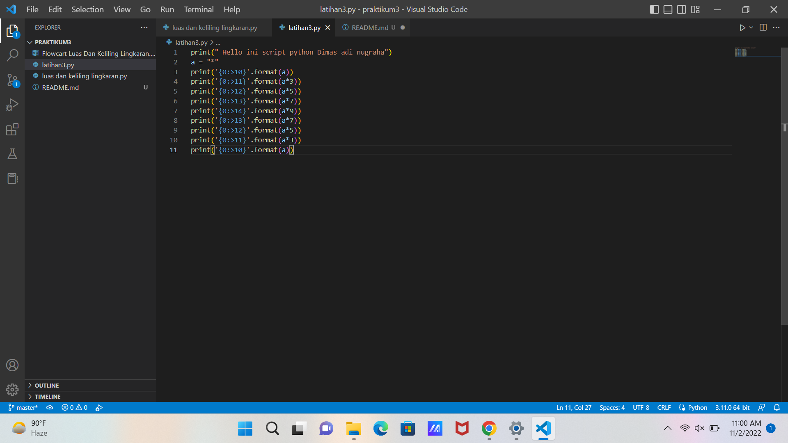

#praktikum3
# membuat pola ketupat
fungsi format untuk melakukan pengaturan format string yang akan dicetak atau ditampilkan ke monitor sesuai dengan format yang kita buat.

Dan hasil kode programnya adalah:

# *Menghitung Luas dan Keliling Lingkaran*
1. Luas Lingkaran dan Keliling Lingkaran
- Input diameter(d), jari-jari(r), phi, L dan K
- Menghitung L = phi * (r*r)
- Menghitung K = phi * d
- output Luas Lingkaran dan Keliling Lingkaran(print L dan K)

